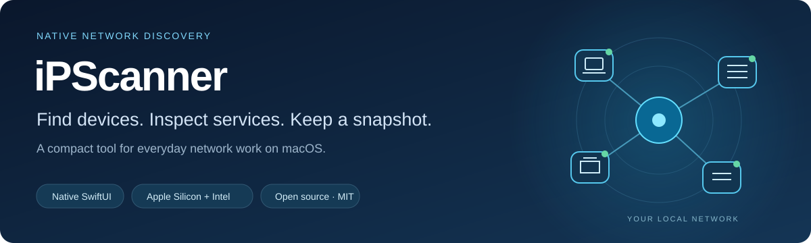

<p align="center">
  
</p>



<p align="center">
  <a href="https://github.com/canberkys/iPScanner/actions/workflows/ci.yml"></a>
  <a href="https://github.com/canberkys/iPScanner/releases"></a>
  
  
  <a href="LICENSE"></a>
</p>

<p align="center">
  <a href="#demo">Demo</a> · <a href="#get-started">Get started</a> · <a href="docs/features.md">Features</a> · <a href="CHANGELOG.md">Changelog</a> · <a href="https://github.com/canberkys/iPScanner/issues/new/choose">Report an issue</a>
</p>

**iPScanner is a compact, native macOS tool for everyday IPv4 network discovery.**
Find responding devices, inspect names and services, add searchable labels, and
save or export what you find. Built with SwiftUI and no third-party runtime dependencies.

> **1.3.0 development preview:** these visuals show the current development version.
> The local app and DMG are Developer ID signed and notarized; a GitHub Release has
> not been published. Some platform and accessibility checks remain open in the
> [acceptance record](docs/acceptance-1.3.0.md).
> The published **v1.2.0 DMG has an opening issue** ([#10](https://github.com/canberkys/iPScanner/issues/10)).
> Until a verified replacement is published, use the source build below.

## Demo


*An 18-second walkthrough assembled from real app screens using a fictional saved
snapshot. It is not a live scan or a scan-speed benchmark.*
[Static overview](docs/media/demo-poster.jpg) · [Screenshot gallery and demo instructions](docs/media/README.md)

## Everyday tasks, one window

| Task | In iPScanner |
|---|---|
| Discover devices | Enter an IP, CIDR, range or imported target list. Choose Quick, Standard or Deep. |
| Understand a result | Inspect DNS, MAC/vendor status, open ports, Bonjour services and device-type evidence. |
| Find it again | Add labels and #tags, search results, filter the table and save named networks. |
| Compare and share | Save a snapshot, compare changes, or export CSV, JSON, IP:Port and text reports. |
| Connect and troubleshoot | Open connection tools, check live ping, inspect service banners or send Wake-on-LAN. |

<details>
<summary><strong>Light and dark appearances</strong></summary>

| Light | Dark |
|---|---|
|  |  |

All device names, vendors and labels shown are sample data. [View full-size images](docs/media/README.md).

</details>

## Get started

When a verified replacement is available, download its DMG from [Releases](https://github.com/canberkys/iPScanner/releases),
drag **iPScanner** to **Applications**, then open it.

1. Choose your network from the subnet menu or enter a target you administer.
2. Leave the profile on **Standard** and select **Scan**. **Stop** cancels the run.
3. Search the results or select a device and open **Device Details** (`⌘⌥I`).
4. Add a label, save a snapshot or use **Export** above the results.

**Options** contains scan profiles and repeat intervals. **Tools** contains target
import, the subnet calculator and port scans. AFP and Telnet live under **Advanced**.
See [all features](docs/features.md) or open **Help → iPScanner Help** in the app.

### Try the sample without scanning a network

Download [demo.ipscan.json](docs/media/demo.ipscan.json) using GitHub's **Download raw file**
button. In the app, use **File → Open Scan…** (`⌘O`) to load it. Search for `#lab`
to see tag filtering. Loading the snapshot does not start a discovery scan.
Opening details for the first row runs the ping monitor against localhost only.

### Updates and feedback

- **Automatic update checks:** optional, at launch, at most once every 24 hours.
  Manual checks are available in Help and Settings.
- **Installation is manual:** update links open the GitHub release page.
  Automatic download and installation are not included yet.
- **Feedback:** review your draft in the app before sending it through Cloudflare
  to a **public GitHub issue**. A GitHub account is not required to submit in-app.

### What the results mean

A responding device is observable from your current network; a timeout does not
prove a device is offline. MAC addresses may be unavailable across routers or
because of OS privacy restrictions. Local/randomized MACs do not establish a
manufacturer. Device types are estimates, with evidence in the details view.
Sending a Wake-on-LAN packet does not confirm that a device woke up.

On macOS 27, MAC access may require additional signed capabilities and provisioning.
This remains an [open verification item](docs/acceptance-1.3.0.md).

## Command-line interface

The universal CLI is bundled at `iPScanner.app/Contents/Helpers/ipscanner` and uses
the same discovery engine and export models as the GUI.

```bash
# Quick check of this Mac's loopback address
/Applications/iPScanner.app/Contents/Helpers/ipscanner scan 127.0.0.1 --profile quick

# Scan your target file and write JSON
/Applications/iPScanner.app/Contents/Helpers/ipscanner scan \
  --input targets.csv --profile standard --format json --output scan.json
```

Run `--help` for all options. Exit codes: `0` success, `1` input error, `2` runtime error.
The old `Contents/MacOS/ipscanner` path has moved to avoid the filename collision in #10.

## Build and test

Requirements: macOS, Xcode with an SDK supporting the macOS 14.4 deployment target,
and [XcodeGen](https://github.com/yonki/xcodegen).

```bash
brew install xcodegen
git clone https://github.com/canberkys/iPScanner.git
cd iPScanner
xcodegen generate
open iPScanner.xcodeproj
```

Choose the **iPScanner** scheme and run with `⌘R`.

```bash
xcodebuild test -scheme iPScanner -destination 'platform=macOS' CODE_SIGN_IDENTITY=-
python3 scripts/build-vendor-db.py --check
(cd feedback-relay && npm test)
```

The latest local validation passed **190 application tests and 6 Worker tests**.
See the [acceptance table](docs/acceptance-1.3.0.md) for tested methods and limitations;
a universal build is not proof of testing on Intel hardware or every supported OS.

## Privacy and distribution

- No telemetry. Discovery runs on the targets you select.
- GitHub is contacted for update checks; feedback is sent only when you submit it.
  Scan results, IPs and MACs are not attached to feedback automatically.
- Vendor matching uses a compact offline IEEE index. Raw pinned sources and
  provenance notes are in [data/ieee](data/ieee/).
- Signed packaging validates GUI/CLI identity, architectures, notarization,
  stapling, DMG integrity and SHA-256. [Signing guide](docs/signing-guide-tr.md).

## What's next

Finish the remaining compatibility and accessibility checks, then develop the new
visual identity and automatic update installation. History, IPv6 and menu-bar mode
are outside the current update. [Next-phase plan](docs/next-phase-plan-tr.md).

## Project

[Changelog](CHANGELOG.md) · [Draft 1.3.0 notes](docs/release-notes-1.3.0.md) ·
[Bug reports and feature requests](https://github.com/canberkys/iPScanner/issues/new/choose) ·
[Website](https://canberk.me/ipscanner/)

MIT © Canberk Kılıçarslan — [LICENSE](LICENSE).
Vendor registry data: [IEEE Standards Association](https://standards-oui.ieee.org/).
