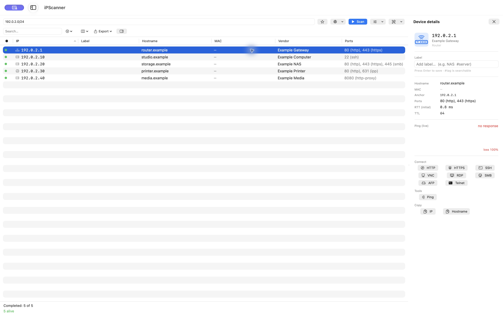
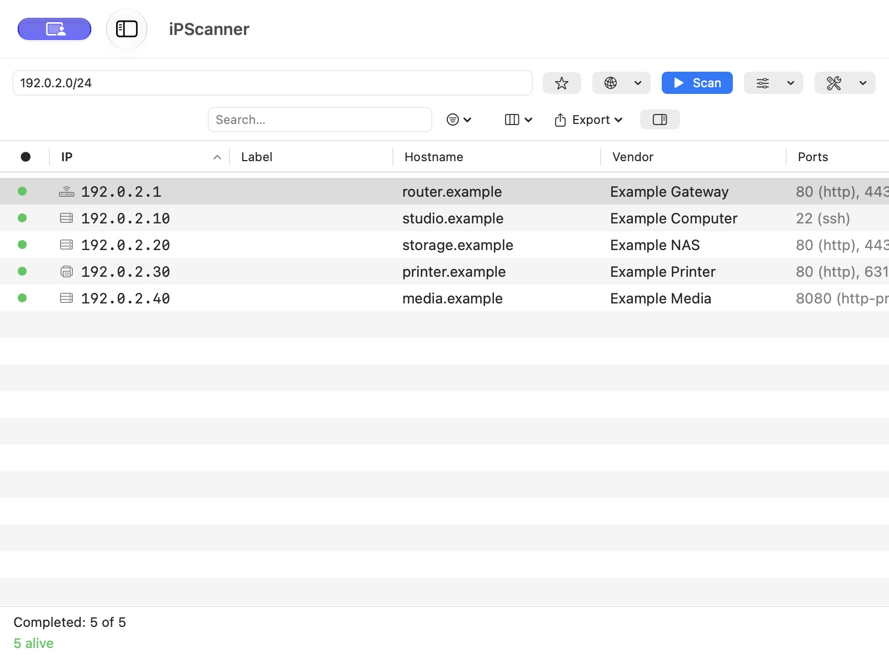

<div align="center">
  
  <h3><em>See every device on your network.</em></h3>
  <p>
    <a href="https://canberk.me/ipscanner/"></a>
    <a href="https://github.com/canberkys/iPScanner/releases/latest"></a>
    <a href="LICENSE"></a>
    
    
  </p>
</div>

---

# iPScanner — A native macOS network scanner

Open-source macOS counterpart to Advanced IP Scanner. Built with native SwiftUI, zero third-party dependencies, universal binary (Apple Silicon + Intel).

## Help and preferences

Open **Help → iPScanner Help** for getting started, scan profiles, troubleshooting,
snapshots, exports and keyboard shortcuts. **Help → Report an Issue…** opens a
bug or feature request draft with a preview and optional environment information.
Send Feedback creates a public GitHub issue through a Cloudflare Worker after
you review and submit. No GitHub account is required. The relay requires its
server-side GitHub secret before live delivery is available.

**Settings (⌘,)** includes the scan profile, appearance and automatic update checks.
You can always check manually. Update links open release notes and downloads;
installation is manual.

## Screenshots

<div align="center">
  
  <p><em>Updated results toolbar and explicitly opened device details. This screenshot uses fictional demo devices.</em></p>
</div>

<div align="center">
  
  <p><em>Compact window with saved ranges hidden. Scan profiles and automatic rescan are in Options; target import and subnet calculation are in Tools. Demo data shown.</em></p>
</div>

---

## Installation

1. Download the latest `.dmg` from **[Releases](https://github.com/canberkys/iPScanner/releases/latest)**.
2. Open the `.dmg` and drag `iPScanner.app` into `Applications`.
3. Open iPScanner from Applications. New release packages must pass Developer ID signing and Apple notarization before publication.

> **v1.2.0 packaging issue:** the published DMG can exit immediately because its CLI overwrote the GUI executable. Removing quarantine does not fix this. See [issue #10](https://github.com/canberkys/iPScanner/issues/10) and the [investigation](docs/issue-10-investigation.md). Version 1.3.0 is in preparation; use a verified replacement release when available.

Device discovery uses local network operations. There is no telemetry. Automatic update checks contact GitHub Releases at most once every 24 hours; Help also offers a manual check. The app runs without App Sandbox for its network discovery tools.

---

## Features

<details>
<summary><strong>Discovery</strong> — CIDR/range, ping, TCP fallback, ARP, OUI vendor (3-tier), mDNS, banners</summary>

- **CIDR + range input** — `10.0.0.0/24`, `192.168.1.50-192.168.1.200`, or comma-separated multiple ranges (`10.0.0.0/24, 172.16.0.0/24`)
- **Auto-detected default subnet** from the active interface (en0/en1)
- **Concurrent ping** (32 parallel) using `/sbin/ping`
- **TCP fallback probe** (445/80/443/22/3389) for hosts that block ICMP — Windows Firewall, etc.
- **Reverse DNS** with 1-second timeout (race-cancelable)
- **MAC address** via `arp -an` parsing
- **Vendor lookup** with the bundled IEEE OUI registry — MA-L (24-bit), MA-M (28-bit), and MA-S (36-bit) for sub-block accuracy
- **mDNS / Bonjour** service discovery (`_airplay`, `_homekit`, `_smb`, `_ssh`, `_ipp`, `_googlecast`, …)
- **HTTP / HTTPS title** and **SSH banner** fetch on demand (port-scan banner enrichment)

</details>

<details>
<summary><strong>Actions</strong> — port scanner, context menu, Wake-on-LAN, multi-select</summary>

- **Port scanner** — common-ports preset, web preset, custom ranges (`8000-8100`), bounded concurrency to avoid connection storms
- **Right-click context menu** per host: HTTP / HTTPS / SSH / VNC / RDP / SMB / AFP / Telnet / Ping in Terminal / Refresh / Wake-on-LAN / Copy IP/Hostname/MAC / Remove from list
- **Wake-on-LAN** — UDP magic packet, single host or bulk
- **⌘C** copies selected IP(s) from the table
- **Multi-select** for bulk actions

</details>

<details>
<summary><strong>Inspector</strong> — auto-opens on selection, ping monitor, action grid</summary>

Select a host and choose Device Details (⌘⌥I). Details open in a sheet in compact windows and a resizable panel in wide windows.

- Header — device-type icon, IP, vendor, classification
- Inline label editor with `#tag` syntax (searchable, MAC-anchored, persisted)
- Full info: hostname, MAC, anchor, open ports (with service names), service title, RTT, TTL, NetBIOS name & workgroup (Standard / Deep)
- mDNS services list
- Live ping monitor — sparkline + avg / min / max / loss stats (1s interval, 60-sample buffer)
- Action grid grouped into Connect / Tools / Copy

</details>

<details>
<summary><strong>v1.1 additions</strong> — scan profiles, interface picker, auto-rescan, snapshot diff, search highlighting, warnings hub</summary>

- **Scan profiles** — *Quick* (ping only) / *Standard* (+ TCP fallback) / *Deep* (+ auto port scan & banner fetch on alive hosts)
- **Network interface picker** — choose `en0` / `en1` / `utun` (VPN) from a menu; subnet auto-fills
- **Auto-rescan** — off / 30 s / 1 m / 5 m / 15 m, kicks in after the previous scan finishes
- **Change detection / snapshot diff** — load a previous `.ipscan.json` as comparison baseline; per-row badges (`+` new, `~` changed, `−` missing) plus a summary popover listing missing hosts
- **Permission/failure surfacing** — status-bar warnings hub (ARP table empty, banner fetch failures) with a click-through detail popover
- **Search match highlighting** — query substrings highlighted in IP / Hostname / MAC / Vendor / Title / Label cells
- **Resizable inspector** — drag the divider; width persisted

</details>

<details>
<summary><strong>v1.2 additions</strong> — file import, CLI binary, NetBIOS, subnet calculator, update check, TTL, new export formats</summary>

- **File import** — feed a `.txt` / `.csv` of IPs, CIDRs, or ranges instead of typing into the range field; invalid lines reported, duplicates deduped
- **`ipscanner` CLI** — headless binary inside the app bundle for cron / launchd / scripts (see [Command-line interface](#command-line-interface-ipscanner))
- **NetBIOS name fetcher** — Standard / Deep profiles pull Windows computer name + workgroup via UDP 137 when DNS is stale
- **Subnet calculator popover** — `function` icon in the toolbar; `/N` → network, broadcast, host range, count, dotted mask, wildcard
- **In-app update check** — auto-checks GitHub Releases once per 24 h, also available under `Help → Check for Updates…`
- **TTL column** — parsed from `/sbin/ping`, optional column with an OS hint tooltip
- **IP:Port export** and **Text Report export** — flat `ip:port` lines for piping into Nmap / firewalls, and a padded human-readable report for tickets

</details>

<details>
<summary><strong>Persistence & I/O</strong></summary>

- **Saved ranges** with friendly names (`Home`, `Office VLAN`) — sidebar with rename support
- **Snapshot save/load** — `.ipscan.json`, ⌘O / ⌘⌥S
- **Export** as CSV / JSON / **IP:Port list** / **Text Report** / clipboard
- Per-host labels persisted in `UserDefaults`

</details>

<details>
<summary><strong>UX</strong> — split view, app menus, appearance picker, status bar</summary>

- macOS-native: `NavigationSplitView` (sidebar + detail + inspector), `ContentUnavailableView`, App-menu commands, custom About panel, GitHub Help menu
- **Appearance picker** in `View → Appearance` (System / Light / Dark)
- **Live updates** — alive hosts stream into the table as they're discovered
- **Status bar** — progress, alive count, filter match, elapsed time, warnings, diff summary
- Sandbox disabled (required for ICMP / ARP / raw socket access)

</details>

---

## Command-line interface (`ipscanner`)

The same scanning engine is exposed as a headless `ipscanner` binary inside the app bundle, suitable for cron jobs, `launchd`, or piping into other tools.

```bash
# Discover hosts on a subnet, write JSON to a file
/Applications/iPScanner.app/Contents/Helpers/ipscanner 10.0.0.0/24 \
  --profile standard --format json --output scan.json

# Scan a target list from CSV with port scan + banner fetch, emit ip:port lines
/Applications/iPScanner.app/Contents/Helpers/ipscanner \
  --input targets.csv --ports 22,80,443 --fetch-banners --format ip-port

# Quick (ICMP-only) scan to stdout
/Applications/iPScanner.app/Contents/Helpers/ipscanner 192.168.1.0/24 --profile quick --format txt
```

Run `--help` for the full flag list. Exit codes: `0` success, `1` argument / input error, `2` runtime / scan error.

For convenience you can symlink it onto your `PATH`:

```bash
sudo ln -s /Applications/iPScanner.app/Contents/Helpers/ipscanner /usr/local/bin/ipscanner
```

---

## Build from source

**Requirements**: macOS 14.4+, Xcode 15+, [xcodegen](https://github.com/yonki/xcodegen)

```bash
brew install xcodegen
git clone https://github.com/canberkys/iPScanner.git
cd iPScanner
xcodegen generate
open iPScanner.xcodeproj
# Cmd+R to build and run
```

<details>
<summary>OUI databases & tests</summary>

Raw IEEE databases are pinned in `data/ieee/`. The app bundles only `iPScanner/Resources/vendors.json`, a compact prefix/organization index. Run `python3 scripts/build-vendor-db.py` to regenerate it; builds validate it with `--check`. Source URLs and SHA-256 hashes are embedded in the index. The original retrieval date is unknown and recorded as null.

MAC addresses are available only when the OS and local network expose them. macOS 27 may require the Network Topology Observation capability and a provisioning profile. Locally administered addresses do not establish a manufacturer. Device types are estimates; inspect a device to see the evidence.

```bash
xcodebuild test -scheme iPScanner -destination 'platform=macOS'
```

190 application tests cover the parsers (CIDR/range, ports, target file), OUI 3-tier vendor lookup, NetBIOS wire-format build & response parsing, subnet calculator, CSV / IP:Port / text-report escaping, snapshot encode/decode, snapshot diff, device classifier, saved-range model, CLI argument parser, and update-version comparison.

</details>

---

## Signed distribution

See the [step-by-step signing guide](docs/signing-guide-tr.md) and [1.3.0 release notes](docs/release-notes-1.3.0.md). The CLI now lives in `Contents/Helpers/ipscanner`; update existing scripts accordingly.

## Roadmap

<details>
<summary><strong>v1.0 — completed</strong></summary>

- [x] Multi-range scan input
- [x] TCP fallback probe (ICMP-blocked hosts)
- [x] mDNS / Bonjour discovery
- [x] Wake-on-LAN
- [x] Saved ranges with names + Rename
- [x] Snapshot save/load (`.ipscan.json`)
- [x] Per-host labels (MAC-anchored, `#tag` searchable)
- [x] Live ping monitor in inspector
- [x] Service-name column for ports (22 → ssh, 9100 → printer, …)
- [x] HTTP title / SSH banner enrichment
- [x] OUI MA-L + MA-M + MA-S (sub-block accuracy)
- [x] App-menu commands + keyboard shortcuts
- [x] Appearance picker (System / Light / Dark)

</details>

<details>
<summary><strong>v1.1 — completed</strong></summary>

- [x] Scan profiles — Quick / Standard / Deep
- [x] Network interface picker
- [x] Auto-rescan
- [x] Change detection / snapshot diff
- [x] Permission/failure surfacing
- [x] Search match highlighting
- [x] Resizable inspector

</details>

<details>
<summary><strong>v1.2.0 — Operations focus — completed</strong></summary>

Moved iPScanner from a desktop tool to a usable operations tool. This release also folds in enterprise-enrichment work (NetBIOS, subnet calculator, update check) that shipped inside the same `v1.2.0` tag.

- [x] **File import** — read targets from `.txt` / `.csv` (IP, CIDR, range), dedupe, report invalid lines
- [x] **TTL column** — parsed from `/sbin/ping` output, optional column, included in CSV / JSON export, OS hint tooltip
- [x] **IP:Port list export** — flat `ip:port` lines for piping into Nmap, firewall rules, scripts
- [x] **TXT report export** — human-readable summary suitable for tickets and email
- [x] **`ipscanner` CLI** — headless binary inside the app bundle. Flags: `--input`, `--ports`, `--profile`, `--fetch-banners`, `--format json|csv|txt|ip-port`, `--output`, `--quiet`, `--help`. Exit codes for automation. Single-IP scans (`ipscanner 127.0.0.1`) supported.
- [x] **NetBIOS name fetcher** — UDP 137 query for Windows host name / workgroup when DNS is stale
- [x] **Subnet calculator popover** — `/N` to network / broadcast / host-count, useful inline tool
- [x] **In-app update check** — periodic GitHub Releases API check, alert with View Release / Skip / Later, manual `Help → Check for Updates…`

</details>

### v1.3 — Hardening + persistent operations

- [ ] **Notarized release** — mandatory signing pipeline is implemented; final certificate-backed release verification is pending.
- [ ] **launchd-backed scheduled scans** — true background scans even when the app is closed (in-memory auto-rescan stays as the foreground equivalent)
- [ ] **History / time-series** — long-term per-host first-seen / last-seen / port-state tracking on top of the existing snapshot model

<details>
<summary><strong>Deferred (P2)</strong> — open to demand, not on the active list</summary>

- Multi-ping at scan time with packet-loss percentage (live inspector already covers the diagnostic case; 3× scan time is rarely worth it)
- Filtered-port detection (`open` / `closed` / `filtered` distinction; risk of mis-classification on TCP timeout)
- XML export
- Append-to-file export mode (snapshot diff is the cleaner historical model)

</details>

<details>
<summary><strong>Out of scope</strong> — explicit non-goals</summary>

- Public plugin API. Internal protocols (`TargetProvider`, `HostEnricher`, `ScanExporter`) keep the codebase clean without committing to a stable extension contract.
- Random IP feeder (Angry IP Scanner-style). Doesn't match the operational use case and invites misuse.
- HTTP proxy detection / arbitrary HTTP sender. Out of scope for a discovery tool; covered better by `curl`.
- Menu-bar mode with new-device notifications. CLI + `launchd` is the more flexible path for the same goal.
- IPv6 support. Niche for typical macOS LAN discovery; will reconsider on user demand.

</details>

---

## Tech stack

SwiftUI (macOS 14.4+, `@Observable`, `NavigationSplitView`) · Swift Concurrency (`async/await`, `TaskGroup`, `AsyncStream`) · Network framework (`NWConnection`, `NWBrowser`) · `Process` for `/sbin/ping`, `/usr/sbin/arp` · zero third-party Swift packages.

---

## License

MIT — see [LICENSE](LICENSE).

Vendor data from the [IEEE Standards Association OUI registries](https://standards-oui.ieee.org/) (public).

## Author

**Canberk Kılıçarslan** — [canberkki.com](https://canberkki.com)

Feedback, bug reports, and pull requests welcome via [Issues](https://github.com/canberkys/iPScanner/issues).
