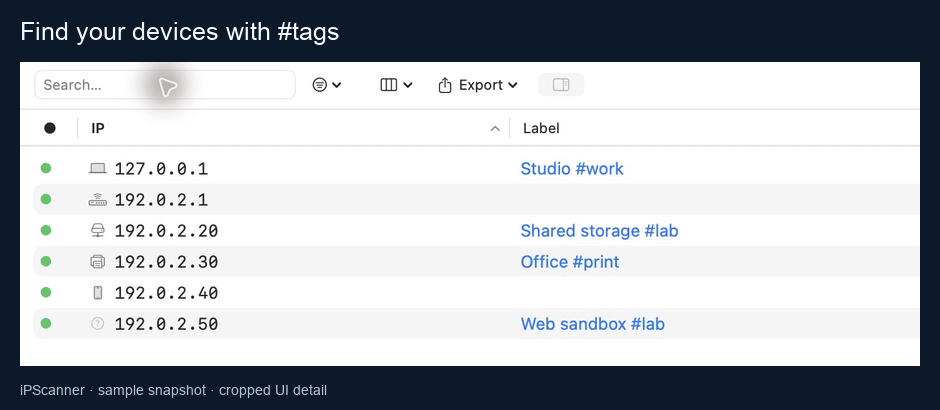
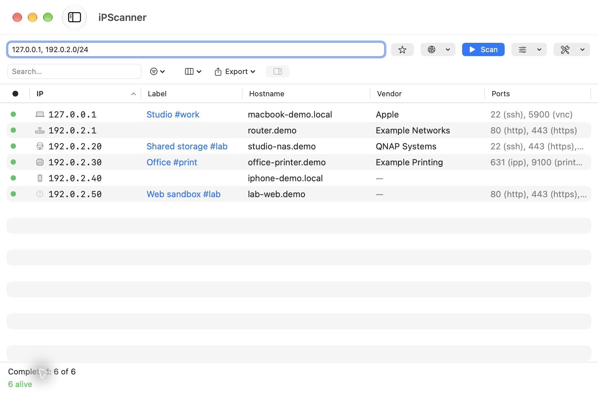
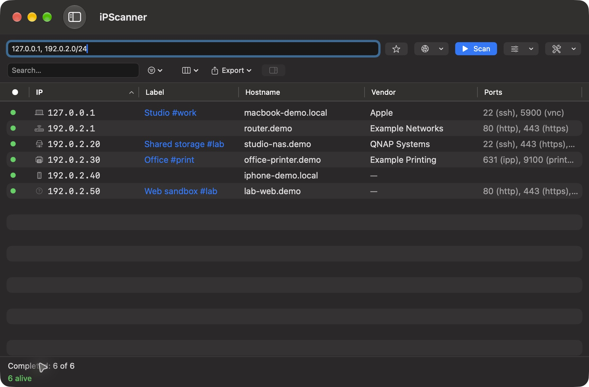
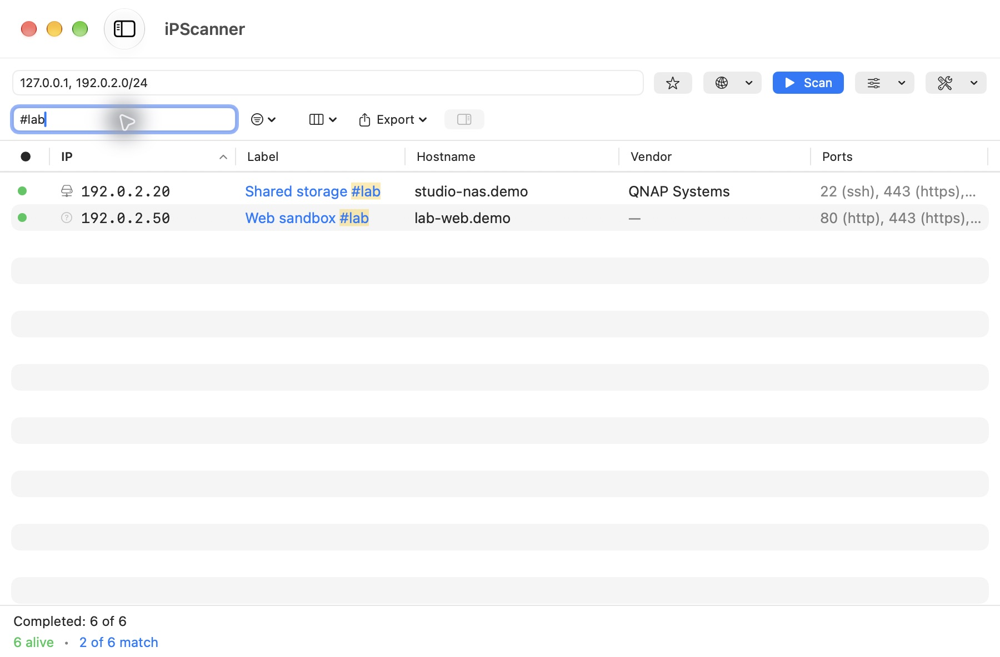
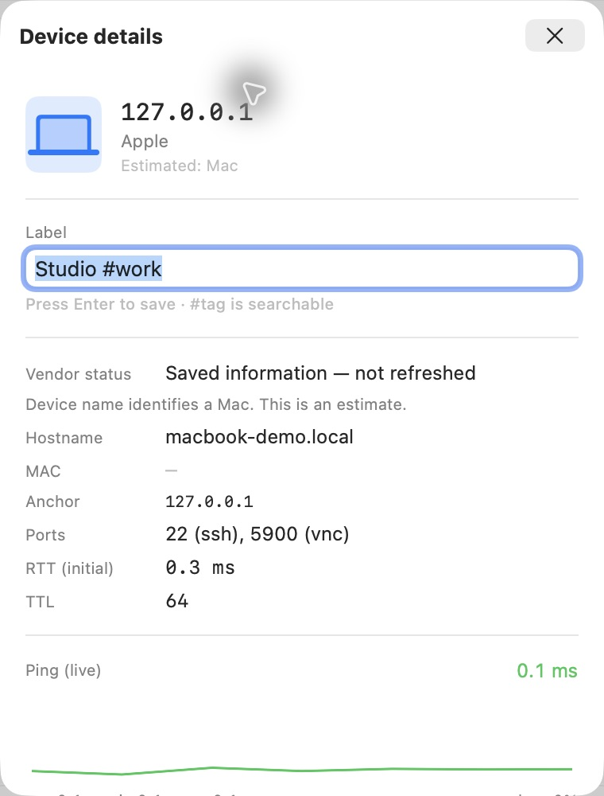
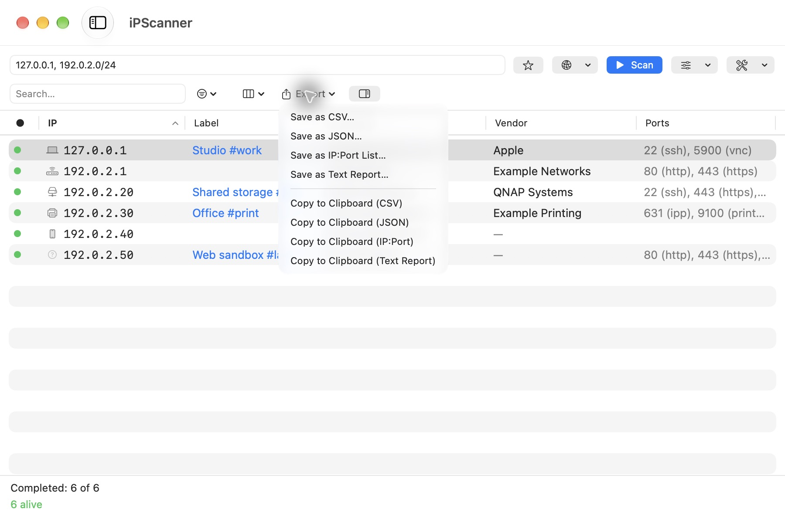

# iPScanner product tour

[Back to the project](../../README.md)

These captures show the native 1.3.0 app with a fictional saved snapshot.
No user's devices, network addresses or MAC records are included. The first row
uses 127.0.0.1 so opening its inspector only pings the local Mac. Other addresses
come from the documentation range 192.0.2.0/24. Do not start a scan of the fixture.

## Walkthrough

This 5.5-second loop shows the actual search UI: all six sample devices, entering
`#`, then narrowing the list to the two devices tagged `#lab`. It is cropped to
search, addresses and labels for readability. The full UI is shown below.
It does not represent live discovery or elapsed scan time.

[Static tour cover](demo-poster.jpg)

## Try it yourself

Download [demo.ipscan.json](demo.ipscan.json) with GitHub's **Download raw file**
button, then use **File → Open Scan…** (`⌘O`). Loading a snapshot does not run
network discovery. Existing labels may be merged with the sample's labels, so use
a separate macOS test account if you want a completely isolated demo.

## Screenshots

### Compact results

### Search labels and tags

### Device details

[Wide window with the right-side inspector](wide-inspector.jpg)

### Export

## Refreshing the media

Capture the actual app with this fixture in an isolated app identity or test
account. Keep network/device details fictional and verify every image before
committing. Capture via the normal macOS UI; do not redraw application controls.

`scripts/build-demo-media.py` assembles the walkthrough from the JPEG captures.
It requires Pillow only as a documentation build tool. The app uses Sparkle for
updates. The refreshed radar icon is shared by the app and README.
